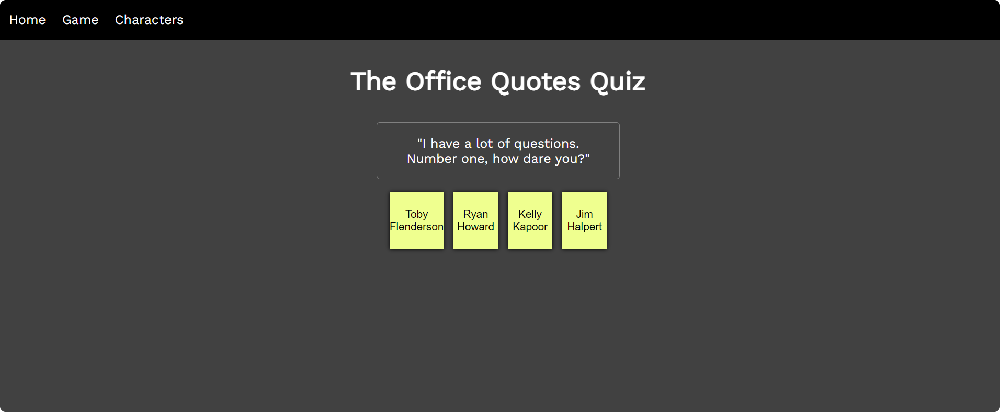

# The Office Quiz

The office quiz is a responsive website for bored students (or for bored people in general) who also happen to be enjoy the tv show "The Office" (US) and want to enjoy themselves a little bit with a quiz.

The website contains a quiz in which you need to guess which character from the tv show, said the quote.

On the following site is a live demo: https://rvdegroen.github.io/web-app-from-scratch-2223/spa/

# Table of Contents

# Used Technologies

I used the following technologies:

1. Html
2. Css
3. Javascript
4. The Office API

# Installation

If you're wondering how to install my application, simply follow the following steps:

1. Clone this repository on your local machine with `git clone https://github.com/rvdegroen/web-app-from-scratch-2223.git`
2. Make sure you install the `live server` extension if you're using VSCode
3. Go into the `spa` folder, where you can find the application
4. Start the application by clicking on the live server extension and you're all set

# License

The source code is distributed under the GPL-2.0 license. See LICENSE.md for more information.

# Wishlist

This is my wishlist:

- [x] Hash routing
- [x] Responsive design
- [x] Filtering
- [ ] Loading state
- [ ] Zero State
- [x] Error state
- [x] Ideal sate
- [x] Write Wiki
- [x] Clean code
- [x] Fetch and displaying data from an api
- [ ] Activity diagram
- [x] ReadMe
- [ ] Better styling

# Resources

I have put most sources in between my code where I used the code. I also used https://openai.com/blog/chatgpt sometimes and changed the code. Mostly used it in the beginning of this project for inspiration.
